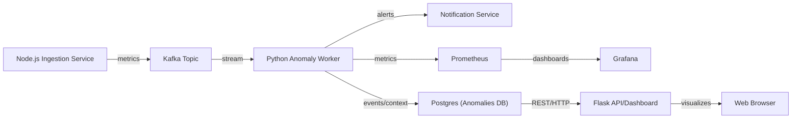

# Real-time Event-Driven Anomaly Detection System

## Project Overview

A scalable, explainable, and robust real-time anomaly detection platform using an event-driven architecture. It ingests and analyzes metrics, detects anomalies via tunable statistical and machine learning methods, persists rich event context, and presents results in a modern interactive dashboard.

---

## Features

- **Event-Driven Architecture:**
  - Node.js service simulates/generates metrics and streams them to Kafka.
  - Python worker consumes metrics, detects anomalies in real time.
- **Observability & Metrics with Prometheus + Grafana:**
  - The Python anomaly worker exposes a Prometheus-compatible `/metrics` HTTP endpoint (default: `http://localhost:8000/metrics`).
  - Metrics include: processed metric count, detected anomaly count, event processing latencies, and health.
  - `/infra/prometheus.yml` and Docker Compose provisions the stack.
  - Grafana can be linked to Prometheus to visualize real-time time-series and alert on detection rates, etc.
- **Hardened, Explainable Anomaly Detection:**
  - Two core detectors:
    - **Moving Average Detector:** Rolling mean + deviation, tunable window/threshold, explains every detection.
    - **Isolation Forest Detector (ML):**
      - Advanced outlier detection using Exponential Moving Average smoothing
      - Adaptive dynamic thresholding of anomaly scores based on rolling statistics
      - Minimum consecutive anomaly duration rule (suppresses one-off spikes)
      - All parameters (batch size, contamination, alpha, min streak) tunable via ENV or constructor
      - Each detection saved with full buffer, scores, config, and rationale for later review
- **Persistence and Audit:**
  - All detected anomalies (with full context/config) saved in PostgreSQL (table: `anomalies`)
  - Schema upgrades in `/infra/db-migration-anomaly-table.sql`
- **API & Interactive Web Dashboard:**
  - Flask REST API exposes detected anomalies and full context (JSON)
  - Direct, modern dashboard at `/ui`:
    - See all anomalies in real time
    - Review detection method, score, and drill down into exact context/config for each alert
    - Responsive, scrollable, and visually readable layout
    - Columns: ID, Detected At, Value, Method, Score, Context, Config

---

## Architecture



---

## Metrics, Monitoring & Visualization

- **Prometheus Integration**
  - The anomaly worker exposes an HTTP `/metrics` endpoint. Metrics follow Prometheus exposition format, e.g.:
    - `anomaly_events_total` (total anomalies detected)
    - `metrics_processed_total` (total metrics seen)
    - Latencies, uptime, and queue gauge metrics
  - Default endpoint: `http://localhost:8000/metrics`
  - Prometheus is pre-configured via `infra/prometheus.yml` for local use.

- **Grafana Dashboards**
  - Grafana is provisioned in Docker Compose for exploring, alerting, and visualizing Prometheus metrics.
  - Common visualizations: anomaly rate over time, ingestion processing rate, worker health, etc.
  - Dashboards can be added/imported in Grafana web UI.

### Starting Prometheus & Grafana locally

```sh
cd anomaly-detection-system/infra
docker-compose up prometheus grafana
# Prometheus: http://localhost:9090/
# Grafana:   http://localhost:3000/ (admin:admin by default)
# Add your Prometheus data source (http://prometheus:9090).
```


## Setup & Usage

### 1. Clone and Install

```sh
git clone <this-repo>
cd anomaly-detection-system
# Node.js metric service
cd ingestion-service && npm install
# Python anomaly worker
cd ../anomaly-worker && python3 -m venv venv && source venv/bin/activate
pip install -r requirements.txt
```

### 2. Start Infrastructure

- Make sure Kafka and Postgres are running (see `infra/docker-compose.yml`).
- Apply the migration in `infra/db-migration-anomaly-table.sql` to Postgres.

### 3. Run the System

- **Start node metric generator:*
  ```sh
  cd ingestion-service
  node producer.js
  ```
- **Start anomaly worker:**
  ```sh
  cd ../anomaly-worker
  source venv/bin/activate
  python3 -m src.main
  ```
- **Start Flask API/Dashboard:**
  ```sh
  cd src
  python3 api.py
  # Access via http://localhost:5000/ui
  ```

### 4. Configuration & Tuning

Key detector parameters can be set via environment variables or directly in code (for advanced tuning):

| ENV Variable                | Meaning                              | Default   | Applies To   |
|-----------------------------|--------------------------------------|-----------|--------------|
| MA_WINDOW_SIZE              | Window size (moving average)         | 5         | MA           |
| MA_THRESHOLD                | Deviation threshold                  | 20        | MA           |
| IF_BATCH_SIZE               | IsolationForest batch size           | 20        | IF           |
| IF_CONTAMINATION            | IsolationForest contamination        | 0.1       | IF           |
| IF_SMOOTHING_ALPHA          | EMA smoothing factor (0.1-0.5 common)| 0.25      | IF           |
| IF_MIN_ANOMALY_CONSEC       | Minimum consecutive anomalies        | 3         | IF           |

---

## Anomalies & UI Dashboard

- Each anomaly event is persisted with:
  - All input values/buffers used to make the decision
  - Detection method, score, z-score, config, and trigger reason
  - JSON context/config visible as expandable, readable cells in dashboard
- UI table columns:
  - **ID**, **Detected At**, **Value**, **Method**, **Score**, **Context**, **Config**

---

## Advanced Features

- **Adaptive detection:** All logic explained/parameterized per event.
- **Noise resistance:** Spurious/one-off spikes are suppressed by a tunable minimum duration streak.
- **Transparency:** All detection logic/data is open for review and UI drilldown.
- **Live REST API:** Full anomaly timeline/context at `/anomalies` (JSON), for integration or scriptable analytics.
- **Modern dashboard:** Mobile-friendly, auto-updating, and easy to review at `/ui`.

---

## Requirements

- Python 3.8+
- Node.js 16+
- Kafka, Postgres
- Libraries: numpy, scikit-learn, flask, psycopg2-binary, (see requirements.txt)

---

## Example Data Flow

```
New metric stream → Smoothing (EMA) → Isolation Forest (fit + predict)
   → Score + Z-Score Calculation → Adaptive threshold check
   → Minimum duration check → Save anomaly (if triggered, with context/config)
   → /anomalies API + Dashboard UI
```

---

## Limitations & Future Work

- Current detectors are univariate; extend to multivariate if needed.
- Only metric ingestion via Kafka; can be extended to REST or gRPC.

---

## Authors & License

MIT Licensed. Contributions welcome!
